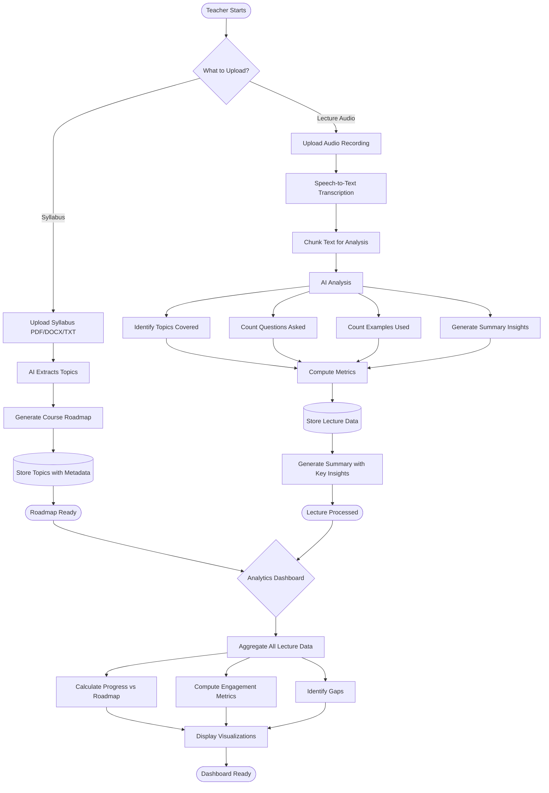

# Teaching Aid 📚

**AI-Powered Classroom Analytics & Lecture Tracking Assistant**

Teaching Aid helps educators analyze their teaching habits, track student engagement, and monitor classroom performance through automated lecture transcription, AI-generated summaries, and comprehensive analytics. Built for teachers who need efficient classroom review with data-driven insights.

> **⚠️ Important:** This tool **assists** teachers—it does **not** replace professional judgment or comprehensive teaching evaluation. Every insight should be reviewed in context of your classroom environment. This is an analytical aid, not a replacement for teacher expertise.

---

## 🎬 Demo

[](#)

*Demo video coming soon*

---

## 🎯 Use Cases We Cover

**What This Tool Does:**

1. **Syllabus Roadmap Generation**
   - Upload course syllabus (PDF/text format)
   - AI generates complete course topic roadmap
   - Visual timeline of topics to be covered
   - Automatic topic hierarchy and dependencies

2. **Lecture Audio Analysis**
   - Upload audio recordings of lectures
   - Automatic transcription to text
   - AI-generated lecture summaries
   - Extraction of topics covered that day
   - Identification of key points and concepts

3. **Student Engagement Tracking**
   - Tracks number of questions asked during lecture
   - Identifies which topics generated most questions
   - Provides engagement metrics per lecture
   - Historical engagement trends across sessions

4. **Teaching Progress Monitoring**
   - Counts examples used in each lecture
   - Tracks topics covered vs. topics missed
   - Compares actual progress against syllabus roadmap
   - Identifies topics needing more attention

5. **Classroom Analytics Dashboard**
   - Aggregated statistics across all lectures
   - Student participation trends
   - Topic coverage completion percentage
   - Teaching style metrics (examples/hour, questions/hour)

**What This Tool Does NOT Do:**
- ❌ Grade assignments or exams
- ❌ Replace teacher assessment or evaluation
- ❌ Monitor individual student performance
- ❌ Record video or identify students

---

## 🗺️ Architecture

### Data Flow

**Upload Pipeline:** Teacher uploads syllabus → AI extracts topics and generates roadmap → Topics stored with metadata. **Lecture Pipeline:** Audio recording uploaded → Speech-to-text transcription → Text chunked and analyzed → AI identifies topics covered, questions asked, examples used → Metrics computed and stored → Summary generated with key insights.

**Analytics Pipeline:** All lecture data aggregated → Progress calculated against syllabus roadmap → Engagement metrics computed → Trends identified → Dashboard displays visualizations and insights.


---

## 🛠️ Tech Stack

**Frontend:**
- Next.js 14 + React 19 + TypeScript
- Tailwind CSS + shadcn/ui components
- Recharts for analytics visualization
- Lucide Icons

**Backend:**
- FastAPI + SQLModel (SQLite/PostgreSQL)
- **OpenAI Whisper** / **AssemblyAI** — Audio transcription
- **Google Gemini AI** (`gemini-2.0-flash`) — Syllabus analysis, lecture summarization, topic extraction
- **sentence-transformers** — Semantic topic matching (all-MiniLM-L6-v2)

**AI Pipeline:**
- Audio-to-text conversion
- NLP-based question detection
- Semantic topic extraction
- Example counting with pattern recognition
- Automated summary generation

---

## 📋 Features Breakdown

### 1. Syllabus Roadmap
- **Input:** Course syllabus (PDF/DOCX/TXT)
- **Output:**
  - Complete topic hierarchy
  - Estimated timeline per topic
  - Topic dependencies and prerequisites
  - Visual roadmap with milestones

### 2. Lecture Transcription & Summary
- **Input:** Audio recording (MP3/WAV/M4A)
- **Output:**
  - Full text transcript
  - Lecture summary (200-300 words)
  - Topics covered that day
  - Key concepts emphasized
  - Timestamp markers for important sections

### 3. Student Engagement Metrics
- **Tracked Metrics:**
  - Total questions asked
  - Questions per topic
  - Average questions per lecture
  - Engagement score (0-100)
  - Most engaging topics

### 4. Teaching Tracker
- **Tracked Metrics:**
  - Number of examples used
  - Examples per topic
  - Topics fully covered
  - Topics partially covered
  - Topics not yet addressed
  - Progress % against syllabus

---

## 🚀 Installation

### Prerequisites
- Node.js 18+
- Python 3.10+
- API keys: [Google Gemini](https://makersuite.google.com/app/apikey) and [OpenAI](https://platform.openai.com/) or [AssemblyAI](https://www.assemblyai.com/)

### Backend Setup

```bash
cd backend
python -m venv venv

# Windows
.\venv\Scripts\activate
# macOS/Linux
source venv/bin/activate

pip install -r requirements.txt
```

Create `backend/.env`:
```env
# Enter your API keys
GEMINI_API_KEY=your_gemini_api_key
OPENAI_API_KEY=your_openai_api_key
# OR
ASSEMBLYAI_API_KEY=your_assemblyai_api_key

# Database (optional - defaults to SQLite)
DATABASE_URL=sqlite:///./teaching_aid.db
```

Run backend:
```bash
uvicorn main:app --reload --port 8000
```

Backend: `http://localhost:8000` | API docs: `http://localhost:8000/docs`

---

### Frontend Setup

```bash
cd frontend
npm install  # or pnpm install / yarn install
npm run dev  # or pnpm dev / yarn dev
```

Frontend: `http://localhost:3000`

---

## 📖 How to Use

### Step 1: Create a Course
1. Click "New Course" in the sidebar
2. Enter course name and description
3. Upload your syllabus (PDF, DOCX, or TXT)
4. AI generates a complete topic roadmap

### Step 2: Upload Lecture Audio
1. Select your course from the sidebar
2. Click "Upload Lecture"
3. Choose audio file from your recording
4. Add lecture date and optional notes
5. System processes audio and generates transcript

### Step 3: Review Lecture Summary
1. View auto-generated summary
2. Check topics covered that day
3. Review key concepts highlighted
4. See student questions tracked

### Step 4: Monitor Progress
1. Open "Analytics Dashboard"
2. View syllabus progress percentage
3. Check engagement metrics
4. Identify topics needing more attention
5. Review examples-per-topic statistics

### Step 5: Plan Next Lecture
1. See which topics were missed
2. Review student question patterns
3. Adjust teaching approach based on insights
4. Prepare examples for upcoming topics

---

## 📊 Project Structure

```
backend/
  ├── main.py              # FastAPI app
  ├── database.py          # Database setup
  ├── models.py            # Course, Lecture, Transcript schemas
  ├── routes/
  │   ├── courses.py       # Course CRUD + syllabus upload
  │   ├── lectures.py      # Audio upload → transcription pipeline
  │   ├── analytics.py     # Dashboard metrics and insights
  │   └── export.py        # PDF/CSV export
  └── services/
      ├── transcription.py # Whisper/AssemblyAI integration
      ├── gemini_client.py # AI analysis and summarization
      ├── nlp_processor.py # Question detection, example counting
      └── topic_matcher.py # Semantic topic extraction

frontend/
  ├── app/                 # Next.js pages
  │   ├── courses/         # Course list and details
  │   ├── lectures/        # Lecture viewer
  │   └── analytics/       # Dashboard
  ├── components/          # React components
  │   ├── syllabus-upload.tsx
  │   ├── lecture-summary.tsx
  │   ├── analytics-charts.tsx
  │   └── progress-tracker.tsx
  └── lib/api.ts           # API client
```

---

## 💡 Benefits

**For Teachers:**
- Stay organized with automated lecture summaries
- Track teaching progress against syllabus goals
- Identify topics that need more examples or clarification
- Save time on manual note-taking and review

**For Classroom Improvement:**
- Data-driven insights into student engagement
- Identify which topics generate most questions
- Monitor teaching patterns and adjust approach
- Evidence-based planning for future lectures

**For Accountability:**
- Document all topics covered with timestamps
- Track completion percentage of syllabus
- Export reports for academic review
- Maintain historical record of teaching activities

---

## 🔐 Privacy & Data Handling

- **No student identification:** System tracks aggregate questions, not individual students
- **Audio privacy:** Recordings are processed and can be deleted after transcription
- **Local storage:** All data stored locally or on your chosen server
- **Secure API:** All external API calls use encrypted connections
- **Data export:** You own all transcripts, summaries, and analytics

---

## 🛣️ Roadmap

**Coming Soon:**
- [ ] Multi-language transcription support
- [ ] Integration with Learning Management Systems (LMS)
- [ ] Automated quiz generation from lecture content
- [ ] Sentiment analysis of student questions
- [ ] Mobile app for on-the-go lecture recording
- [ ] Comparison analytics across multiple courses
- [ ] AI-powered teaching recommendations

---

## 🤝 Contributing

Contributions are welcome! Please feel free to submit a Pull Request.

---

## 📄 License

MIT License

---

## 📧 Support

For questions or issues, please:
- Open an issue on GitHub
- Contact: [your-email@example.com]

---

**Built with ❤️ for educators**
